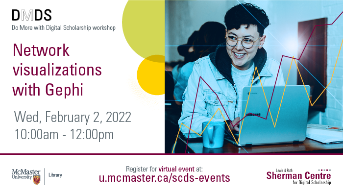

# Network Visualizations with Gephi

Learn to graph data and visualize networks at this workshop on Gephi. Devon Mordell (Educational Developer, MacPherson Institute) will teach participants how graph data can help express relationships between entities and visualize networks for Humanities scholars. The group will use a visualization tool intended for social network analysis, Gephi, to map and identify relationships within a dataset scraped from Twitter. This session will be recorded and made available openly.

**The recording and materials for this workshop are available here**: <https://learn.scds.ca/intro-gephi/>

## Facilitator Bio

Devon Mordell draws on her experience in media art, hobbyist programming and instructional design to teach workshops for the Sherman Centre. Her areas of interest in digital scholarship include data visualization, computational analyses of texts, sonification and critical digital humanities. Her research practice explores the algorithmic culture industry and platform psychogeography.