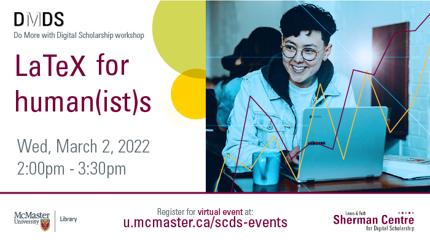

# LaTeX for Human(ist)s

LaTeX is a typesetting and document creation program that has a lot of traction in STEM areas (compsci and maths especially, due to its facility with mathematical symbols) but very little pickup with folks in the Humanities. At this session, John Fink (Digital Scholarship Librarian) will discuss why this doesn’t have to be the case.

We’ll learn about how LaTeX can be used by Humanities scholars and discuss topics like what makes *typesetting* different from a *word processor*, why LaTeX still has resonance today despite being invented in the 1970s, why maths nerds love the program, and why people who might ordinarily use Word might want to think about maybe not using Word. This session will be recorded and made available openly.

**The recording and materials for this workshop are available here**: <https://learn.scds.ca/intro-latex/>

## Facilitator Bio

John Fink’s (he/they) talents lie in complex and innovative systems administration and project management. He also has an interest in the maker/hacker element in digital scholarship, and is frequently spotted tinkering with esoteric hardware. If you are interested in having the Sherman Centre support your project, John is an excellent first contact.