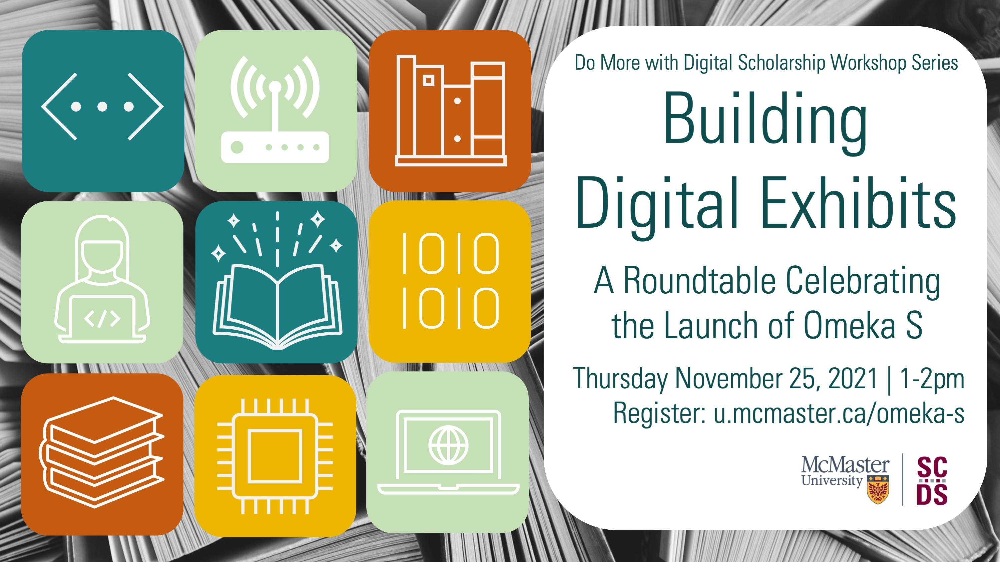

# Building Digital Exhibits: A Roundtable Celebrating the Launch of Omeka S

Learn about the variety of uses and possibilities for digital scholarly exhibits with the digital exhibit platform Omeka S. In this roundtable. members of the McMaster community will share some of their experiences working with Omeka in classroom projects, research dissemination, organizing digital collections, and more.

<!-- ## Facilitator Bio -->

<!-- Missing bio -->

## Workshop Recording

<iframe height="416" width="100%" allowfullscreen frameborder=0 src="https://echo360.ca/media/5cd3445b-d03f-43d3-ac09-98509d9b6d75/public"></iframe>
[View original here.](https://echo360.ca/media/5cd3445b-d03f-43d3-ac09-98509d9b6d75/public)

## Additional Resources

- See the [“Posters of the 1848 French Revolution”](https://expo.mcmaster.ca/s/french-revolution-of-1848/page/welcome) Omeka S exhibit discussed by Myron Groover and Nina Sartor
- See the [“Women and Social Movements in the 19th and 20th Centuries”](https://womenandsocialmovements.omeka.net/) Omeka S exhibit discussed by Karen Balcom and Rachel Manes
- Learn the basics of Omeka with this [asynchronous module](https://scds.github.io/Omeka-S/) by Dr. Amanda Montague. These videos will show you how to create an archival item collection, add metadata, and build a digital exhibit.

### Sample Omeka Exhibits
- [African Brilliance: A Diplomat’s 60 Years of Collecting](https://exhibitions.psu.edu/s/african-brilliance/page/splash)
- [Speak Out: Documenting the History of the LGBTQIA+ Community at Dartmouth College](https://exhibits.library.dartmouth.edu/s/SpeakOut/page/home)
- [Shining a Light: 21st Century Music from Underrepresented Composers](https://exhibits.library.umkc.edu/s/shining-a-light/page/home)
- [Constructing Gender: The Origins of Michigan’s Union and League](https://exhibits.bentley.umich.edu/s/constructing_gender/page/introduction)