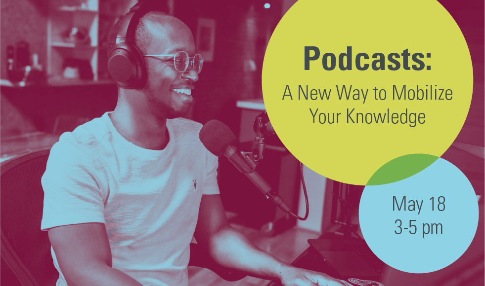

# Podcasts: A New Way to Mobilize Your Knowledge

Podcasts can take academic research out of the ivory tower and into the public. Learn the basics of podcasting at this workshop from podcaster and SCDS Coordinator Veronica Litt and Digital Media Specialist Elaine Westenhoefer. 

This intensive workshop is for academics and researchers who are interested in creating a podcast about their work. We’ll discuss how to plan a show, best practices for recording crisp, professional audio, and give participants hands-on experience with editing on Audacity, a free and open source audio editing software. We’ll also discuss how to brand your show, go through the basics of hosting and distribution, then discuss how to promote your podcast and build an audience. 

This workshop will not be recorded. You can however find another workshop module on Podcasting here: <https://learn.scds.ca/podcasting/>