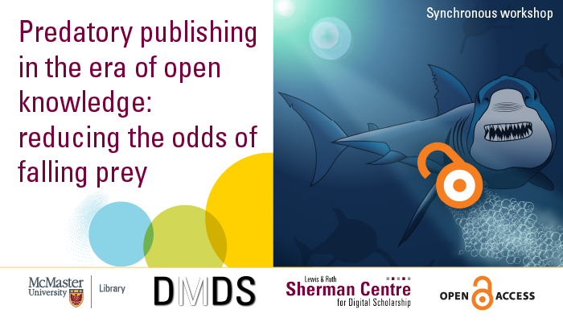

# Predatory Publishing in the Era of Open Knowledge: Reducing the Odds of Falling Prey

Thinking about where to publish? Do you receive random invitations to submit your work for publications? Don’t get caught publishing in a questionable journal! This virtual workshop provides an overview of what predatory journals are and tips on how to avoid them. The co-presenters, Neera Bhatnagar and Olga Perkovic, also include suggestions on how to avoid predatory conferences.

<!-- ## Facilitator Bio -->

<!-- Missing bio -->

## Workshop Recording

<iframe height="416" width="100%" allowfullscreen frameborder=0 src="https://echo360.ca/media/4ad59980-c19c-4322-b0dd-f0e01f7ac4ea/public"></iframe>
[View original here.](https://echo360.ca/media/4ad59980-c19c-4322-b0dd-f0e01f7ac4ea/public)

Please note that at 40:57, Neera says "predatory publishing" when she is actually referring to "predatory conferences."

## Additional Resources

### Resources Mentioned in the Talk
- McMaster LibGuide on ["How to How To Avoid Predatory Publishers and Conferences"](https://libguides.mcmaster.ca/predatorypublishing)
- PDF of ["Identifying Deceptive Publishers: A Checklist"](https://libguides.mcmaster.ca/ld.php?content_id=36114576)
- [Think Check Submit](https://thinkchecksubmit.org/) (a resource to help you identify predatory journals and publishers)
- [Think Check Attend](https://thinkcheckattend.org/) (a resource to help you identify predatory conferences)
- The [DOAJ](https://doaj.org/) (Directory of Open Access Journals)

### Extra Resources

Websites:
- [Cabells The Source](https://blog.cabells.com/)
- [Cabells Twitter Account](https://twitter.com/cabellspublish)

Articles:
- Cobey KD, Grudniewicz A, Lalu MM, et al. “Knowledge and motivations of researchers publishing in presumed predatory journals: a survey.” BMJ Open 2019;9:e026516. DOI: <https://bmjopen.bmj.com/content/9/3/e026516>
- Grudniewicz, A., Moher, D., Cobey, K. D., … Lalu, M. M. (2019). “Predatory journals: no definition, no defence: a comment.” Nature, 576, 210-212. DOI: <https://doi.org/10.1038/d41586-019-03759-y>
- Moher, D., Shamseer, L., Cobey, K. et al. (2017). “Stop this waste of people, animals and money.” Nature 549, 23–25. DOI: <https://doi.org/10.1038/549023a>
- Puzic, S. (2016, September 29). “Offshore firm accused of publishing junk science takes over Canadian journals.” Retrieved November 22, 2021, from <https://www.ctvnews.ca/health/offshore-firm-accused-of-publishing-junk-science-takes-over-canadian-journals-1.3093472>
- Shrestha, J. (2021). “Predatory journals as threats to the academic publishing: a review.” Journal of Agriculture and Natural Resources, 4(2), 1-10. DOI: <https://doi.org/10.3126/janr.v4i2.33640>
- Siler, K., Vincent-Lamarre, P., Sugimato, C. R., Lariviere, V. (2021). “Predatory publishers’ latest scam: bootlegged and rebranded papers: a comment.” Nature, 598, 563-365. DOI: <https://doi.org/10.1038/d41586-021-02906-8>