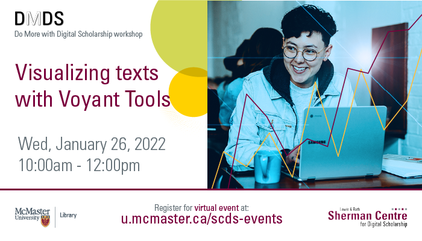

# Visualizing Texts with Voyant Tools

Learn how you can create publication-quality figures using ggplot2. We will cover plotting options for one- and two-dimensional continuous and categorical data and explore options for customizing your figure’s appearance. 

## Workshop Preparation 

Access the workshop files here:
- [workshop-file-ggplot2.R](workshop-file-ggplot2.R)

An installation of [R](https://www.r-project.org/) and [RStudio](https://posit.co/downloads/) will also be needed.

<!-- ## Facilitator Bio -->

<!-- Missing bio -->

## Workshop Recording

<iframe height="416" width="100%" allowfullscreen frameborder=0 src="https://echo360.ca/media/66dbdd5f-1e35-4675-bc09-a5e7d4e7f0e1/public"></iframe>
[View original here.](https://echo360.ca/media/66dbdd5f-1e35-4675-bc09-a5e7d4e7f0e1/public)
